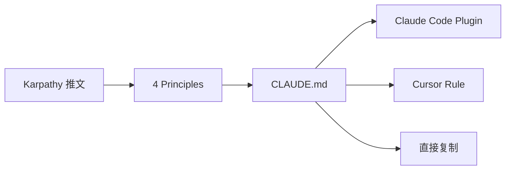

# Summary — multica-ai/andrej-karpathy-skills

Karpathy 对 LLM 编码陷阱的四条行为准则：先想再写、极简优先、手术式修改、目标驱动执行。

## 核心要点

1. **Think Before Coding**: LLM 会静默选择假设并一路跑偏，准则强制显式声明假设和困惑
2. **Simplicity First**: 200 行能缩到 50 行就重写，不做投机性抽象
3. **Surgical Changes**: 每行改动都必须能追溯到用户请求，不碰无关代码
4. **Goal-Driven Execution**: 将指令转化为声明式目标 + 验证循环，让 LLM 自主闭环

## 架构图

## 与 wiki 其他实体的关联

- [[entities/concepts-frameworks/gstack]] — Garry Tan 的技能包，更侧重角色分工，与本项目互补
- [[entities/concepts-frameworks/agent-skills]] — Addy Osmani 的 20 技能库，侧重工程流程
- [[concepts/Harness Engineering]] — 本项目的四条准则是 Harness Engineering 的具体实践
- [[concepts/SDLC Agent Skills Pattern]] — SDLC 六阶段模式可与本项目的目标驱动执行配合

## 相关链接

- GitHub: https://github.com/multica-ai/andrej-karpathy-skills
- 原始推文: https://x.com/karpathy/status/2015883857489522876
