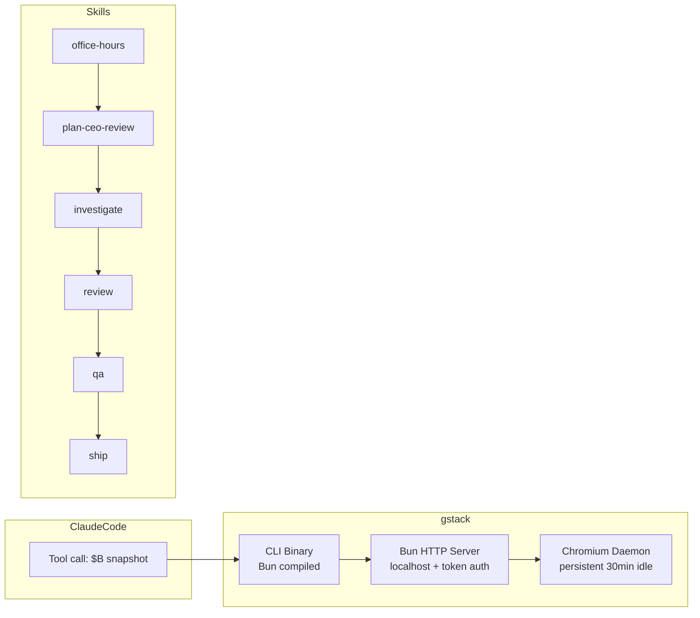

# Summary — garrytan/gstack

YC CEO Garry Tan 开源的 Claude Code 技能包，将单个 AI 助手转变为多角色虚拟工程团队。79k+ GitHub ⭐，14,965 安装，305k 总调用，95.2% 成功率。

## 核心要点

- **持久化 Browser Daemon**：gstack 的 `/browse` 用 Playwright persistent daemon 解决 AI browser tool 的根本问题——冷启动延迟（~100ms/命令 vs 3-5s）和状态丢失（cookies/tabs 持久化）
- **多角色虚拟团队**：23 个 specialist skills，CEO（重审产品方向）/ EM（锁架构）/ Designer（catch AI slop）/ QA Lead（开真实浏览器）/ SRE（canary 监控）/ Release Engineer（ship PR）各司其职
- **铁律式审查链**：`/investigate`（未调查不修复）→ `/review`（pre-landing PR 分析）→ `/qa`（真实浏览器 QA）→ `/ship`（合并+PR）→ `/canary`（部署后监控）
- **跨会话学习**：`learnings.jsonl` 让 agent 从历史 session 中提取 pattern/pitfall/preference，不重复犯错
- **Boil the Lake 原则**：做完整的事情，当 AI 让边际成本接近零时

## 架构

## 与 wiki 其他实体的关联

- [[entities/gstack]] — 完整 entity（33 个 skill 表格、架构详解、 Hermes 对比）
- [[entities/OpenClaw]] — gstack 与 OpenClaw ACP 深度集成，Claude Code sessions via ACP
- [[entities/superpower-with-files]] — 同样解决 AI coding harness 问题，但 superpower 用 TDD loop，gstack 用 multi-role review pipeline
- [[concepts/Harness-Engineering]] — gstack 是 Harness Engineering 的生产级参考实现

## 相关链接

- GitHub: https://github.com/garrytan/gstack
- Top skills: `/qa` (57,650)、`/plan-eng-review` (28,014)、`/office-hours` (24,817)、`/ship` (18,899)
